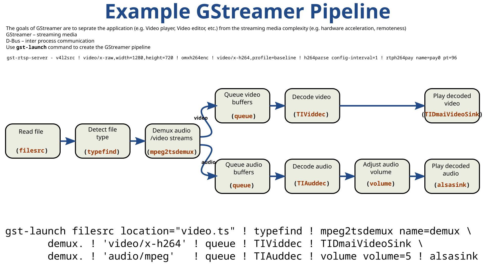

USB web cameras, they geninely are saviors for hundreds of poor college students who need to set up a camera feed. The issue with video streaming is that images are very taxing on wireless transmisiton networks if they have limited data. In my situation, I had to set up several USB cameras to stream video in live with very low latency (.2 seconds delay max). The trick for students is to use the framework called GStreamer

GStreamer was really useful for getting the video streaming setup working. I was able to stream up to five USB cameras at 640p at the same time, which was more than enough for what I needed. Most of the issues I ran into were not really caused by GStreamer, but more because of USB power limitations or sometimes bandwidth.

For troubleshooting, I would usually start by checking the USB bandwidth available. USB 2.0 (not blue) has a limit around 50MBPS limit so make sure you aren't exceeding that. Additionally, the format which the video is formatted matters, MJPG is usually the best as it uses less bits per pixel. If the bandwith looked fine, then I would check if the cameras were getting enough power. After that, I would try things like switching USB ports, testing a different camera, or running the cameras one at a time. Doing that usually made it pretty easy to narrow down what was actually causing the problem.

GStreamer is also pretty flexible because it can be run straight from Bash or used inside a Python script. It can stream video to a specific IP address, which makes it useful for remote viewing. RTP is especially useful because it has very low delay, while RTSP normally has some built-in buffering that causes more delay. The RTSP delay can still be adjusted though, depending on how the stream is set up.
