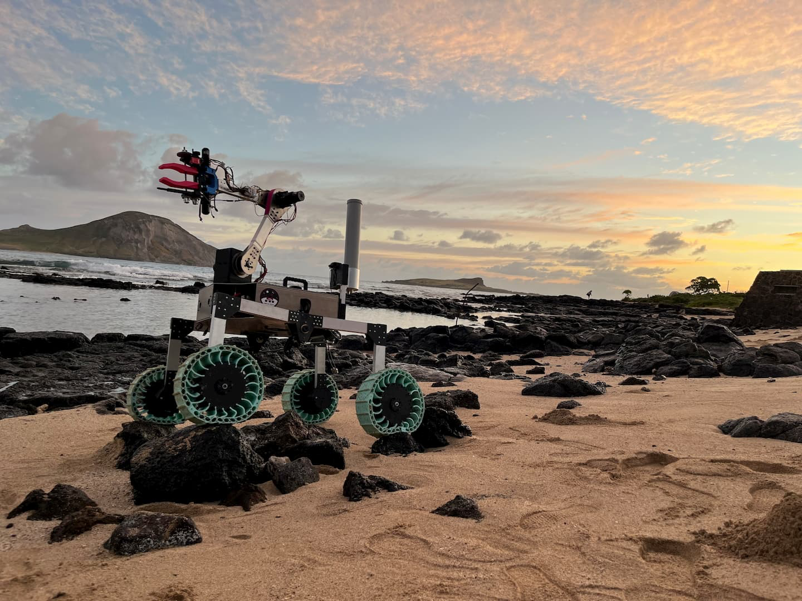

Team RoSE is a student-run Vertically Integrated Project (VIP) focused on designing and building advanced planetary rovers and space-exploration technology

<pre>
Team Robotic Space Exploration, Team RoSE, is the robotics team in the University of Hawaii at Manoa which specializes in creating a mock Mars rover for a international competition called URC, University Rover Challenge.

The competition is broken down into four main missions:

Science

A mission that involves collecting a soil sample from various sites to preform basic science evaluation of the sample onboard. In order to discover if there were any microbial life that was acquired from the sample sites.

Delivery

A teleoperated mission that involves the rover finding, picking up, and delivering objects to astronauts on the field while also traversing through terrain of increasing difficulty.

Equipment Servicing

A teleoperated mission that requires the rover to interact with a mock lander to preform a certain task, including undoing a latch, opening a drawer, and typing in a launch key. Culmating in the precise movement of both the robotic arm and differential drive.

Autonomous Navigation

The rover autonomously must travel to two GNSS location, three post with AR tags, and two objects which requires a careful balance of sensors to approximate its location and movement.

Within Team RoSE, I worked initially worked on the controls for the manually controlled 5 degrees of freedom robotic arm. 

More recent contributions to the team were the development and integration of object detection utilizing a yolov8 model trained on about 4000 images for the purpose of finding several objects in the Utah desert. 

This year, I was the main optical systems developer for Team RoSE. Utilized GStreamer pipeline to allow for smooth image streams for multiple camearas at standard Definition with 0.3 second delays. 
</pre>

